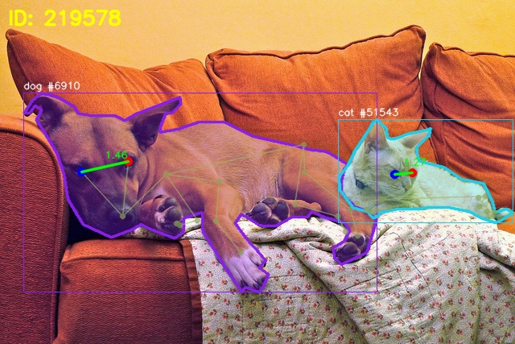

# Animal SegEye Measures



Animal SegEye Measures is a reproducible baseline pipeline for animal-image metrology on COCO.

It is organized around five operator commands:

- `data`
- `annotate`
- `review`
- `predict`
- `validate`

The current baseline focuses on:

- filtering COCO images that contain at least two animals from two target categories
- using COCO `instance mask` as the current contour baseline
- localizing animal eyes with either a CV baseline or an AI baseline
- measuring per-animal inter-eye distance in pixels
- estimating pairwise front/back relationship as a monocular relative-depth proxy
- validating saved predictions against reusable human ground truth

## Scope Boundaries

- Contours currently come from COCO `instance mask`, not from repo-native segmentation inference.
- The AI localization path currently uses `GT bbox + top-down pose inference`, with either a PyTorch/MMPose backend or an ONNX Runtime CPU backend.
- Front/back output is a relative-depth proxy, not a physical 3D distance.

For stable formulas, asset contracts, and methodology details, see:

- [docs/01_architecture.md](./docs/01_architecture.md)
- [system_architecture.md](./system_architecture.md)

## Tech Stack

- Python 3.10
- OpenCV
- NumPy / pandas
- PyYAML
- pycocotools
- OpenMMLab MMPose / MMCV
- ONNX Runtime
- Docker / VS Code Dev Container

## Canonical Entry Point

```bash
python main.py --config config/config.yaml [--verbose] <command> [args]
```

Convenience wrapper:

```bash
make help
```

Document boundary:

- this file is the primary owner of setup and operator workflow
- stable formulas and runtime contracts live in `docs/01_architecture.md`
- detailed status, TODOs, and roadmap live in `docs/02_active_context.md`

Help:

```bash
python main.py --help
python main.py data --help
python main.py annotate --help
python main.py review --help
python main.py predict --help
python main.py validate --help
```

## Local Setup

### Option 1: Local Python environment

```bash
python -m venv .venv
source .venv/bin/activate
pip install --upgrade pip
pip install -r requirements.txt
pip install "numpy<2.0.0" cython "setuptools<70.0.0"
pip install chumpy --no-build-isolation
pip install --no-build-isolation --no-binary xtcocotools xtcocotools
pip install -r requirements-ai.txt
pip install mmcv==2.1.0 -f https://download.openmmlab.com/mmcv/dist/cpu/torch2.1/index.html
```

### Option 2: Dev Container

Use the existing Dev Container configuration:

- [devcontainer.json](./.devcontainer/devcontainer.json)
- [Dockerfile](./.devcontainer/Dockerfile)

In VS Code:

1. Open the repository.
2. Run `Dev Containers: Reopen in Container`.

### Option 3: Plain Docker

Build:

```bash
docker build -t animal-segeye-dev -f .devcontainer/Dockerfile .
```

Run:

```bash
docker run -it --rm --ipc=host -v "$(pwd)":/workspace -w /workspace animal-segeye-dev bash
```

## ONNX Runtime CPU Backend

The ONNX model is intentionally not committed into git history.

Fetch the official artifact into the local ignored `models/` cache:

```bash
python tools/fetch_rtmpose_onnx.py
```

To enable the ONNX backend, set `eye_detection.ai_model.runtime: "onnx"` in
`config/config.yaml` or use a copied config file with:

```yaml
eye_detection:
  ai_model:
    runtime: "onnx"
    providers:
      - "CPUExecutionProvider"
```

The current supported ONNX path is CPU-only and preserves the existing
`GT bbox -> top-down pose -> EyeResult` contract.

## Typical Workflow

### 1. Build a Dataset Asset

```bash
python main.py data --skip-download
```

Useful variants:

```bash
python main.py data --categories cat dog --skip-download
python main.py data --visualize 5 --skip-download
python main.py data --visualize-all --skip-download
```

### 2. Create or update Human GT

Annotate:

```bash
python main.py annotate --dataset-id <dataset_id> --annotator hsien --skip-labeled --no-imshow
```

Review saved overlays:

```bash
python main.py review --dataset-id <dataset_id> --no-imshow
```

### 3. Generate a Prediction Asset

```bash
python main.py predict --dataset-id <dataset_id> --method ai --skip-download
```

For ONNX Runtime CPU, fetch the model first and switch the config runtime to
`onnx` before running the same `predict` command.

With an explicit run id:

```bash
python main.py predict --dataset-id <dataset_id> --method ai --skip-download --run-id demo_run
```

Overwrite only when intentional:

```bash
python main.py predict --dataset-id <dataset_id> --method ai --skip-download --run-id demo_run --overwrite
```

### 4. Validate against Human GT

```bash
python main.py validate --dataset-id <dataset_id> --prediction-run-id <run_id>
```

This user-facing validation path:

- requires Dataset Asset + Human GT + Prediction Asset
- does not rerun detector inference
- does not require raw COCO reload

### Examiner Quick Run

The following sequence is intended for a reviewer or examiner who wants to run
the committed sample workflow without creating new labels.

Fastest wrapper form:

```bash
make full
make examiner
```

Commands:

```bash
python main.py data --skip-download --categories cat dog --visualize-all
python main.py review --dataset-id coco_val2017_cat-dog_23714276 --no-imshow --review-output-dir output/review_labels_smoke
python main.py predict --dataset-id coco_val2017_cat-dog_23714276 --method ai --skip-download --run-id predict_ai_run --output-dir output/predict_ai
python main.py predict --dataset-id coco_val2017_cat-dog_23714276 --method cv --skip-download --run-id predict_cv_run --output-dir output/predict_cv
python main.py validate --dataset-id coco_val2017_cat-dog_23714276 --prediction-run-id predict_ai_run --output-dir output/validate_ai
```

Optional CV comparison:

```bash
python main.py validate --dataset-id coco_val2017_cat-dog_23714276 --prediction-run-id predict_cv_run --output-dir output/validate_cv
```

Notes:

- this sequence assumes the local COCO data required by the repo is already
  present; on a fresh machine, remove `--skip-download` from the `data` step
  first
- `review` also requires the original source images to be available locally
- `predict_ai_run` and `predict_cv_run` are fixed `run_id` values; if they
  already exist, re-run with `--overwrite` or choose different run ids
- this sequence reuses the committed Human GT and therefore skips `annotate`
- the sample `predict_ai_run` command uses the current default AI runtime in
  config; to test ONNX CPU, fetch the model first and switch
  `eye_detection.ai_model.runtime` to `onnx`

## Output Artifacts

### Dataset Asset

- `output/test_samples.csv`
- `assets/datasets/<dataset_id>/manifest.json`
- `assets/datasets/<dataset_id>/instances.csv`

### Human GT Asset

- `assets/ground_truth/<dataset_id>/human_labels.csv`
- `assets/ground_truth/<dataset_id>/meta.json`

### Prediction Asset

- `assets/predictions/<run_id>/run_meta.json`
- `assets/predictions/<run_id>/localization.csv`
- `assets/predictions/<run_id>/measurement_instances.csv`
- `assets/predictions/<run_id>/measurement_pairs.csv`

### Local Model Cache

- `models/rtmpose_ap10k/end2end.onnx`
- `models/rtmpose_ap10k/detail.json`
- `models/rtmpose_ap10k/pipeline.json`
- `models/rtmpose_ap10k/deploy.json`

These files are user-fetched local cache artifacts and are not committed to
git history.

### Reports And Overlays

- `output/data/...`
- `output/review_labels/...`
- `output/predict/...`
- `output/validate/...`

## References

- [docs/01_architecture.md](./docs/01_architecture.md)
- [docs/02_active_context.md](./docs/02_active_context.md)
- [docs/03_dev_journal.md](./docs/03_dev_journal.md)
- [system_architecture.md](./system_architecture.md)

## API / Accounts

This repository is currently CLI-first.

- API service: not implemented
- API docs link: not applicable yet
- test account info: not applicable

## Next Steps

- keep benchmark and parity notes up to date for `PyTorch CPU` vs
  `ONNX Runtime CPU`
- decide later whether ONNX should remain optional or become the default AI
  runtime after more parity validation
- verify prediction parity for:
  - eye coordinates
  - confidence behavior
  - downstream measurement outputs
- keep the current `predict -> validate` contract stable while changing the
  inference backend

## Known Limits

- contour source is still COCO GT mask
- AI path still depends on GT bbox top-down inference
- front/back is still a monocular proxy
- ONNX backend is planned but not integrated into the main path yet
- learned segmentation is still roadmap work, not the current contour source
